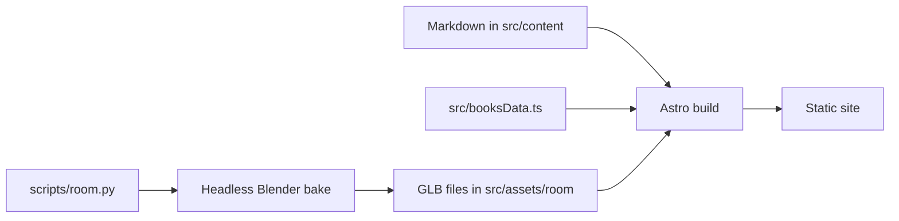

# Mathieu Saugier

Mathieu's personal site: his work, writing, bookshelf, and About page. It is
an [Astro](https://astro.build) site that builds to static HTML. The homepage
also shows a 3D living room, which Blender renders ahead of time and Three.js
displays in the browser.



## Run the site

```sh
bun install
bun run dev        # http://localhost:4321
bun run build      # what the deploy runs
bun run lint
```

The browser checks need Playwright's browsers. Install them once with
`bunx playwright install chromium webkit`.

## Find your way around

| To learn about | Read |
|---|---|
| Who the site is for and what it must never do | [PRODUCT.md](./PRODUCT.md) |
| The words used for each part of the site | [CONTEXT.md](./CONTEXT.md) |
| Colors, type, and layout rules | [DESIGN.md](./DESIGN.md) |
| Why the site stays on Astro | [ADR 0001](./docs/adr/0001-keep-astro-as-the-experience-shell.md) |
| Changing the 3D living room | [Room workflow](./docs/room-workflow.md) |
| What the room should look like | [Room direction](./docs/room-direction.md) |
| Why the room is baked the way it is | [ADR 0002](./docs/adr/0002-room-bake-pipeline.md) |
| The files the room ships | [Room assets](./src/assets/room/README.md) |
| The `/bookshelf/` page | [Bookshelf page](./docs/design/bookshelf-page.md) |
| How book spines are drawn | [Pléiade spines](./docs/design/pleiade-spines.md) |

## Content rules

Mathieu writes all published prose. Don't invent copy, professional claims,
contact destinations, or final artwork.

Each book in `src/booksData.ts` names one edition by its ISBN-13. Its page
count comes from that edition, and `metadataSource` links to where the count
was found. Prefer the publisher's page, then a library catalogue or Open
Library.
