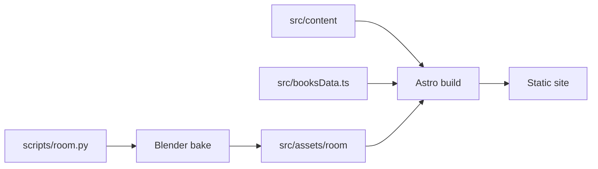

# Mathieu Saugier

Mathieu's site: work, writing, bookshelf, and About page.
[Astro](https://astro.build) builds it to static HTML. The homepage adds a 3D
living room, baked in Blender and drawn by Three.js.



## Run the site

```sh
bun install
bun run dev        # http://localhost:4321
bun run build      # the deploy build
bun run lint
bunx playwright install chromium webkit   # once, for checks
```

## Find your way around

| Topic | Read |
|---|---|
| Audience and hard limits | [PRODUCT.md](./PRODUCT.md) |
| Names for the site's parts | [CONTEXT.md](./CONTEXT.md) |
| Colors, type, and layout | [DESIGN.md](./DESIGN.md) |
| Why Astro | [ADR 0001](./docs/adr/0001-keep-astro-as-the-experience-shell.md) |
| Changing the living room | [Room workflow](./docs/room-workflow.md) |
| The room's target look | [Room direction](./docs/room-direction.md) |
| Why the room bakes this way | [ADR 0002](./docs/adr/0002-room-bake-pipeline.md) |
| Room asset files | [Room assets](./src/assets/room/README.md) |
| `/bookshelf/` | [Bookshelf page](./docs/design/bookshelf-page.md) |
| Book spines | [Pléiade spines](./docs/design/pleiade-spines.md) |

## Content rules

- Mathieu writes all published prose. Never invent copy, professional claims,
  contact destinations, or final artwork.
- Each book in `src/booksData.ts` names one edition by ISBN-13. Its page
  count comes from that edition.
- `metadataSource` cites the count. Prefer the publisher's page, then a
  library catalogue or Open Library.
