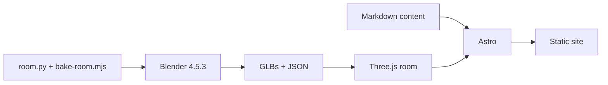

# Mathieu Saugier

Astro site for Mathieu's work, writing, bookshelf, and About page.



## Commands

```sh
bun install
bun run dev
bun run build
bun run preview
bun run lint
bun run tokens:check
bun run room:check chromium
```

The development server runs at `http://localhost:4321`.

## Documentation

- [Product scope](./PRODUCT.md)
- [Project language](./CONTEXT.md)
- [Visual system](./DESIGN.md)
- [Room workflow](./docs/room-workflow.md)
- [Room asset reference](./src/assets/room/README.md)
- [Blender workflow research](./docs/research/blender-mcp-workflow.md)

Published prose is authored by Mathieu. Do not invent copy, professional
claims, contact destinations, or final artwork.
