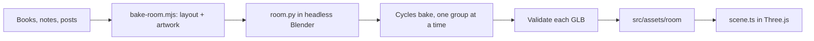

# Bake the living room from code

The homepage shows a 3D living room with a bookcase, a record player, and a
writing desk. It has to look like a rendered image yet load on an ordinary
laptop. It also has to be rebuildable by anyone, or any agent, from what is in
the repository. This record explains how the pipeline meets those constraints,
and what we chose not to do.

## Light is computed once, in Blender

Real-time lighting in the browser is expensive and still looks flat.
Instead, Blender's Cycles renderer computes the light ahead of time and
*bakes* it into textures. Each surface's texture already contains its color,
its shadows, and the light bouncing onto it. The browser then draws every
surface with an unlit material, so the room needs no lights, shadows, or
tone mapping at run time.

The cost is that the lighting is fixed. Moving a lamp means baking again.

## The scene is a script, not a `.blend` file

`scripts/room.py` builds the whole room with Blender's Python API: geometry,
materials, lights, and camera. Headless Blender runs it, bakes, and exports.
A `.blend` file exists only as a disposable preview.

The script builds meshes with `bmesh` rather than `bpy.ops` operators. Every
operator call refreshes the whole scene, and 2,232 of them made building the
room take 32 seconds. With `bmesh` it takes about 2.

The two published rooms we studied, Bruno Simon's *My Room in 3D* and Henry
Heffernan's portfolio, were baked by hand from `.blend` files that were never
committed. Neither can rebuild its own assets. Because ours is a script, any
machine with Blender 4.5.3 can.

## One bake group per file

The room ships as nine GLB files. Each file is one *bake group*: a set of
meshes baked into one shared texture, called an atlas.

The groups exist for baking, not for loading. They differ in two ways:

- **What they see while baking.** Static groups like the walls and furniture
  bake with the whole room around them, so they catch its shadows. Surfaces
  that move, like books, covers, the bookmark, and the manuscripts, bake with
  everything else hidden. Otherwise a book would keep the shadow of the shelf
  it was pulled from.
- **How big their atlas is.** Readable type, such as the spines and the
  manuscripts, gets a 4096-pixel atlas. The bookmark gets 1024.

Because each group is its own file, a change rebakes only the groups it
touches, and the other files stay as they are. A new note rebakes only the
covers, in about 40 seconds.

Each book body bakes alone into a small image, which is then copied into its
own cell of the books atlas. Cycles denoises the whole target image after
every bake, so baking the 55 books straight into the 2048-pixel atlas spent
most of its time denoising it 55 times. The cells cut a 32-sample books bake
from 457 to 29 seconds, and gave each book about twice the texture pixels.

The browser still downloads all nine files at start. We measured deferring
the covers, bookmark, and manuscripts. The first frame arrived only 60 to 100
ms sooner, so we kept the simpler eager load.

## A refactor must show it changed nothing

`--no-publish` prints how far each staged atlas is from the checked-in one:
the mean channel difference and the share of channels off by more than 16.
At production samples, a refactor that changes no geometry or lighting
should show only Cycles noise.

## Only validated files reach the repository

A bake writes into its own temporary work directory. `bake-room.mjs` runs the
glTF validator on every GLB it produced. Only after all of them pass does it
copy them into `src/assets/room/`. A failed bake leaves the checked-in assets
alone, and git undoes a bad publish.

`bun run build` also runs `check-room-assets.mjs`. The script reads the node
names inside the GLBs and fails if a book, note, or post has no baked node, or
if the files exceed 11 MB. Without it, a note written after the last bake
would ship with no cover, and nothing would say so.

## What we chose not to do

- **Compress every group.** The bake compresses `shell`, `furniture`, and
  `objects` with Meshopt, which cut their gzipped size from 3.24 to 1.83 MB.
  The other groups stay uncompressed. Meshopt quantizes positions and moves
  each node's origin to do it, and the browser turns, lifts, or places those
  nodes by their origins. Never run glTF Transform's `optimize` or a default
  `prune` on these files either. Both delete nodes and names that the
  browser code looks up.
- **Use GPU texture formats (KTX2).** The three 4096-pixel atlases take about
  90 MB of GPU memory each. A 2048-pixel atlas uses a quarter of that, so try
  smaller atlases first. Revisit KTX2 if a real phone runs short of memory.
- **Split the scene into linked `.blend` libraries.** That would add a second
  source of truth. One script rebuilds the scene in about 2 seconds.
- **Bake several groups at once.** Cycles on one Apple GPU gains little from
  parallel processes. Each run has its own work directory, so separate
  terminals, agents, or worktrees can still bake without clashing.

## Evidence

- A full bake at 256 samples takes about 25 minutes.
- A production `--only sheets` bake took 257 seconds, 241 of them baking the
  eight manuscripts.
- Two bakes of the same input produced byte-identical geometry. Their
  textures differed by a mean of 0.00005 on the 0 to 255 scale.
