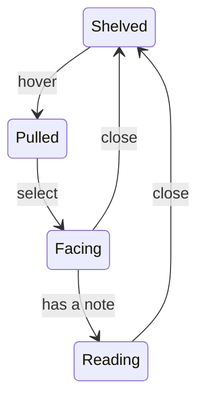

# The bookshelf page

`/bookshelf/` shows Mathieu's reading archive as an oak bookcase of Pléiade
volumes. Three.js paints it in the browser, unlike the homepage room, which
Blender bakes. Without JavaScript or WebGL, the page is a plain reading list.



A book with a note opens into turnable pages, with the bookcase behind it.

## Run and check it

```sh
bun run library                     # dev server on /bookshelf/
bun test                            # shelf packing
bun run library:check               # every engine and viewport
bun run library:check webkit 390    # one case
```

- `library:check` starts its own dev server, unless `DEV_URL` names one.
- A failure names the engine, viewport, and step, and saves
  `/tmp/library-check/FAIL-*.png`.
- The checks pick books from `src/content/notes/`, so one note must exist.
- `playwright` is pinned exactly. Its browsers work only with the version
  that downloaded them.

## Decisions

| Decision | Reason |
|---|---|
| Two canvases | The selected book flies across a transparent canvas above the dialog. The shelf canvas's edge would clip it. |
| The reader is an iframe | StPageFlip 2.0.7 keeps scheduling frames after `destroy()`. Only removing the iframe stops it. |
| Draw on demand | The shelf redraws only when something moves. |
| Painted, not lit | Spines use `MeshBasicMaterial` with canvas textures. Tone mapping desaturated the leather and dulled the gilt. |
| Texture matches display size | A spine draws about 130 CSS pixels wide, so its texture is 256. At 512, 55 books used four times the GPU memory and looked the same. |

## Why the checks run this way

- **One browser per case.** Sharing one per engine put about 28 WebGL
  contexts in a process. Past its limit, WebKit stalls with no error,
  sometimes for over 20 minutes.
- **Two cases at a time.** At three, WebKit throttles a starved page's
  animation frames and the closing animation stalls. A real background tab
  catches up, because motion runs off timestamps. `LIBRARY_CONCURRENCY`
  changes the limit.
- **A time limit on every step and case.** A check that can hang forever is
  not a check.

## Open problems

- Nobody has measured frame rate on a real phone. Viewport emulation can't.

## Credits

- [StPageFlip](https://github.com/Nodlik/StPageFlip), MIT licence, turns the
  pages.
- [The Complete Shelf](https://mengto.github.io/complete-shelf/) inspired the
  selection sequence. We found no reuse licence, so we copied no code or
  assets.
