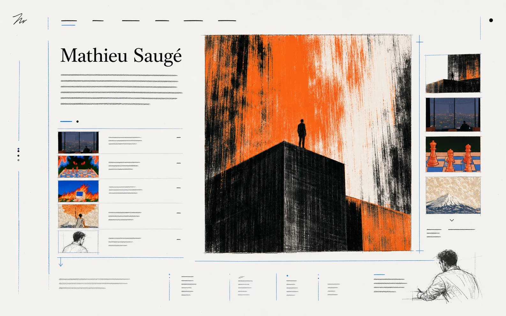
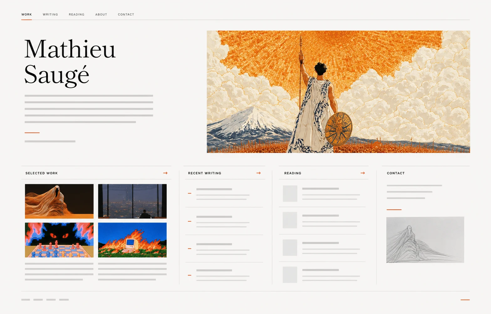

# Visual direction explorations

These sketches preserve the two personal-site directions reviewed after the initial metaphor-led round was rejected. They are direction records, not implementation specifications.

## Living Index — selected for exploration

An immediately recognizable personal website whose originality comes from composition, image behavior, typography, pacing, and transitions. Mathieu's identity, orientation, and primary destinations remain explicit; artwork interrupts and transforms the editorial rhythm at consequential moments.

**Why it is being explored first:** it balances professional clarity and information density with enough visual authority to make the site feel like Mathieu's world.

**Risk:** without decisive image scale and typographic character, it could collapse into a merely tasteful portfolio or blog.

## Editorial Standard — preserved alternative

A high-craft conventional personal site: restrained introduction, selected work, recent writing, reading, and contact arranged in a familiar responsive editorial grid.

**Why it remains valuable:** it establishes the clarity baseline and offers a credible fallback if the Living Index becomes too theatrical or difficult to maintain.

**Risk:** it may be elegant without making Mathieu's personal world or the site's interactive ambition memorable.

## Status

- Living Index: selected for composition exploration.
- Editorial Standard: retained, not rejected.
- No production design has been approved yet.
- `DESIGN.md` remains intentionally unwritten until a visual direction has survived implementation.
