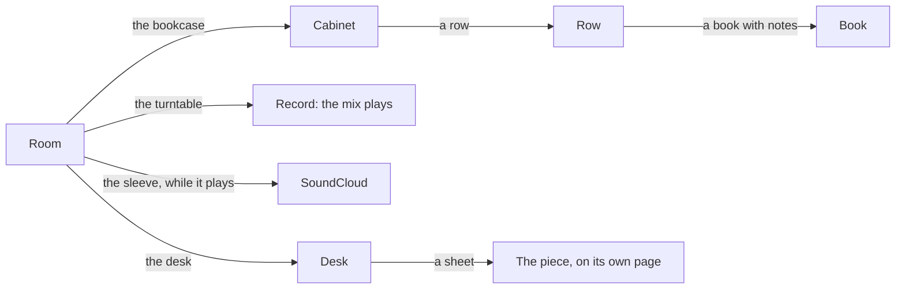

# The living room

The room on the homepage is a dark library someone lives in: books, a record
player, a writing desk. It is also the way into the bookshelf, the music, and
the writing. It adds depth; the page never depends on it.

## How it looks

- Dark green walls, brown oak joinery, oxblood leather, a dense Persian rug.
- Warm lamps make small pools of light. The window brings cool light.
- An isometric cutaway, seen at 4:3. Skip detail that vanishes at page size.

Two reference images, chosen on September 22, set this mood, and the room
matches their composition. Materials vary broadly enough to survive baking:
the rug shifts shade in dye-lot bands, and each wooden board has its own tone.
Fine texture, like leather grain, disappears at page size. Change one material
family per pass, and keep it only if it shows at desktop and laptop sizes.

## How it behaves

One rule: **what glows can be clicked.** Nothing is drawn over the room: no
rings, arrows, captions, or buttons.

| When | The visitor sees |
|---|---|
| Resting | Each clickable thing breathes a low lamplight, out of step with the others |
| Pointed at, or focused | Full lamplight and a pointer, then a small name tag |
| Music playing | The turntable stays lit, and the sleeve on the coffee table joins the glow; it names the mix and leads to SoundCloud |
| At the shelves, music playing | The record plays on, quieter and duller, as if from across the room |
| A book with notes | Its jacket breathes on the shelf |

Each thing also answers with a small physical tell. The tonearm lifts toward
the record, a book leans out of its row, a manuscript lifts off its pile.

### Where you can go

Every step back is the same: click empty space, press Escape, or use the
browser's Back.

### Moving along the shelves

| | Desktop | Phone |
|---|---|---|
| Along a row | Swipe the trackpad sideways, or drag | Swipe sideways |
| To another row | Scroll, or click a row peeking in above or below | Swipe up or down |
| Back out | Click empty space, Escape, Back | Swipe down past the top row, pinch, Back |

On a phone the shelves open full screen, the way a photo does. The first row a
visitor reaches drifts toward what lies past its edge and springs back. That
is the only sign that it goes on.

## What must stay true

- The page works without the room. The poster, the plain links, and the
  room's own book catalog carry everything. If the room cannot render, the
  book list comes back.
- Every clickable thing is a real link or button. Keyboard focus lights it and
  names it at once. Camera controls appear only when they have focus.
- With reduced motion, the light holds still and nothing drifts. Labels still
  appear.
- A phone downloads the 3D room only after a tap.
- A new clickable thing joins the glow. It does not get a widget of its own.
- Without the room, the SoundCloud credit is a tag over the record player.
