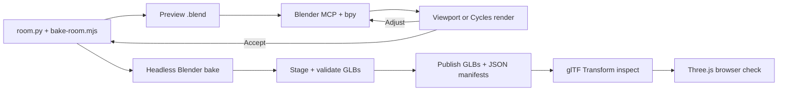

# Change the living room

Use live Blender to find the change. Put the accepted change in the source
scripts, then rebuild the web assets with headless Blender.



## Set up the tools

On a new machine, install Blender 4.5.3 and `uv`. Then install the addon and
register the MCP server:

```sh
uvx --python 3.11 mcp-for-blender install-addon
codex mcp add blender \
	--env UV_PYTHON_PREFERENCE=only-managed \
	--env BLENDER_MCP_SAFE_MODE=1 \
	--env DISABLE_TELEMETRY=true \
	-- uvx --python 3.11 mcp-for-blender
```

If the addon installer cannot find the macOS addon directory, create it and
run the installer again:

```sh
mkdir -p "$HOME/Library/Application Support/Blender/4.5/scripts/addons"
BLENDERMCP_ADDONS_DIR="$HOME/Library/Application Support/Blender/4.5/scripts/addons" \
	uvx --python 3.11 mcp-for-blender install-addon
```

Enable **Interface: MCP for Blender** in Blender. Restart Codex after you change
its MCP configuration.

## Build a scene for live work

Generate a `.blend` file and a Cycles preview from the checked-in source:

```sh
export BLENDER=/Applications/Blender.app/Contents/MacOS/Blender
export BLENDER_VERSION=4.5.3
export ROOM_WORK=/tmp/msaug-room
bun run room:bake --preview
open "$ROOM_WORK/living-room.blend"
```

In Blender, open the 3D View sidebar. Open **MCP for Blender**, then click
**Start MCP Server**.

## Make and judge the change

1. Ask the agent to inspect the objects, transforms, camera, lights, materials,
   and render engine that the change touches.
2. Make one small change through Blender MCP and `bpy`.
3. Capture a viewport screenshot.
4. For lighting, camera, material, or bake work, render a Cycles still.
5. Repeat until the result is correct.
6. Copy the accepted logic into `scripts/room.py` or `scripts/bake-room.mjs`.

Use screenshots to judge the scene. Use MCP and `bpy` to change it. Use GUI
clicks only when an addon has no API.

The live app avoids relaunching Blender between small edits and gives the agent
viewport screenshots. It does not cache Cycles bakes or make a long bake safe
to run through a tool call. Keep final bakes in the logged headless command.
See the [MCP efficiency note](./research/blender-mcp-efficiency.md) for the
socket, timeout, safe-mode, and telemetry limits.

Use Blender MCP only to inspect and test changes. If a problem appears only in
the browser, debug it in the browser instead of adding more Blender machinery.

## Bake the checked-in assets

Choose the smallest valid bake:

| Change | Command |
|---|---|
| Any light, book position, or shared dimension | `bun run room:bake` |
| Static room groups and printed spines | `bun run room:bake --only shell,furniture,objects,moving,spines` |
| Manuscripts | `bun run room:bake --only sheets` |
| Front covers for notes | `bun run room:bake --only covers` |
| Book bodies | `bun run room:bake --only books` |
| Printed spines | `bun run room:bake --only spines` |
| Bookmark | `bun run room:bake --only bookmark` |
| JSON manifests only | `bun run room:bake --layout-only` |

`--room-only`, `--books-only`, and `--spines-only` remain aliases for old
commands. Use `--only` for new work. It accepts a comma-separated list such as
`--only books,covers`.

Use `--no-publish` for pipeline experiments. It performs the requested bake
and validation but leaves the repository assets unchanged.

Use a partial bake only when book positions and cabinet dimensions did not
change. The command rejects a partial bake if either manifest changed. It
builds into the work directory, validates every selected GLB, and replaces the
checked-in files only after Blender exits successfully.

The work directory keeps both the generated source scene and a `-baked.blend`
checkpoint made before export. Keep that directory if export fails; the
checkpoint contains the finished bake and can be reopened without running
Cycles again.

## Check the result

The bake validates every changed GLB. Inspect their size, texture, mesh, and
extension reports before accepting them:

```sh
bunx @gltf-transform/cli inspect src/assets/room/shell.glb
```

Replace `shell.glb` with each changed filename. Then rebuild the poster and test
the browser result:

```sh
bun run room:poster
bun run room:check chromium
bun run room:check chromium --metrics
bun run build
```

The metrics form reports first-frame timing and GLB transfer size. The regular
room check enforces the nine-file contract and an 11 MB initial GLB budget.

The runtime does not configure Draco or Meshopt decoders. Keep compression out
of the checked-in pipeline until the measured saving justifies the decoder and
the compressed asset passes the browser checks.

Read the [asset reference](../src/assets/room/README.md) for output ownership.
