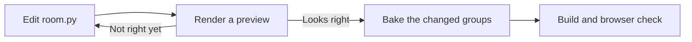

# Change the living room

This guide covers changing anything in the 3D living room: geometry,
materials, lights, camera, or which content it shows. To learn why the
pipeline works this way, read [ADR 0002](./adr/0002-room-bake-pipeline.md).

Two scripts hold the room. `scripts/room.py` builds and bakes the scene in
Blender. `scripts/bake-room.mjs` lays out the books and manuscripts, draws
their artwork, and runs Blender. Change these files, never the GLBs.



## Before you start

Install Blender 4.5.3. The bake refuses any other version. Tell the scripts
where it is:

```sh
export BLENDER=/Applications/Blender.app/Contents/MacOS/Blender
```

## Preview a change

1. Edit `scripts/room.py`.
2. Render the room camera at low quality:

   ```sh
   bun run room:bake --preview --samples 32
   ```

3. Open `preview.png` in the work directory the command prints.

Each run makes a new work directory, so previews in separate terminals or
worktrees never overwrite each other. To keep the preview at a fixed path, set
`ROOM_WORK=/tmp/room` first.

For close-ups, or for many small changes in a row, open `living-room.blend`
from the work directory and change it live through Blender MCP. See
[Set up Blender MCP](#set-up-blender-mcp). Before you judge anything, check
that MCP reports Blender 4.5.3 and has that exact file open. A stale scene from
an earlier run is a common mistake. When a change looks right, copy it back
into `room.py`.

## Bake the groups you changed

Each group is one GLB file in `src/assets/room/`. Bake only the groups your
change touches:

| If you changed | Run |
|---|---|
| A light, a book's position, the cabinet, or anything every group shares | `bun run room:bake` |
| Room geometry or materials, but no lights | `bun run room:bake --only shell,furniture,objects,moving,spines` |
| Spine artwork | `bun run room:bake --only spines` |
| Book bodies | `bun run room:bake --only books` |
| A note, added or removed | `bun run room:bake --only covers` |
| An English post, added or removed | `bun run room:bake --only sheets` |
| The bookmark | `bun run room:bake --only bookmark` |

A change to what someone is reading needs no bake. The browser places the
bookmark itself.

If book positions or cabinet dimensions changed, a partial bake stops and asks
for a full one, because every group is placed from them.

The bake validates each GLB before it copies it into the repository. A failed
bake leaves the checked-in files unchanged. If export fails after baking, the
work directory keeps a `-baked.blend` file with the finished bake.

To test the pipeline without touching the repository, add `--no-publish`. The
`--samples` and `--size` options lower quality for fast experiments, so they
work only with `--no-publish` or `--preview`.

## Check the result

```sh
bun run build                  # includes the baked-content check
bun run room:check chromium    # the room in a real browser
```

`bun run build` runs `bun run room:assets`, which takes under a second. It
fails if a book, note, or post has no baked node, or if the GLBs exceed 11 MB.

`room:check` starts a dev server and loads the room at desktop, laptop, and
phone sizes. Add `--shots` to save frames in `/tmp/room-check`, or `--metrics`
to print load time and transfer size. Replace `chromium` with `webkit` to test
Safari's engine.

If the overview changed, regenerate the poster that shows before the room
loads:

```sh
bun run room:poster
```

A change is done when its bake, `bun run build`, and `room:check` all pass.

## Set up Blender MCP

Blender MCP lets an agent inspect and change a running Blender scene. It is
optional. The headless preview covers most work.

1. Install `uv`, then the Blender addon:

   ```sh
   uvx --python 3.11 mcp-for-blender install-addon
   ```

   If the installer can't find the addon folder, create
   `~/Library/Application Support/Blender/4.5/scripts/addons`, set
   `BLENDERMCP_ADDONS_DIR` to it, and run the installer again.

2. Register the server with your agent. For Claude Code:

   ```sh
   claude mcp add blender -e BLENDER_MCP_SAFE_MODE=1 -e DISABLE_TELEMETRY=true \
   	-- uvx --python 3.11 mcp-for-blender
   ```

   For Codex, run `codex mcp add blender` with the same variables and command.

3. In Blender, enable **Interface: MCP for Blender**. In the 3D View sidebar,
   click **Start MCP Server**.

MCP calls time out long before a production bake ends. Always bake through
`bun run room:bake`.
