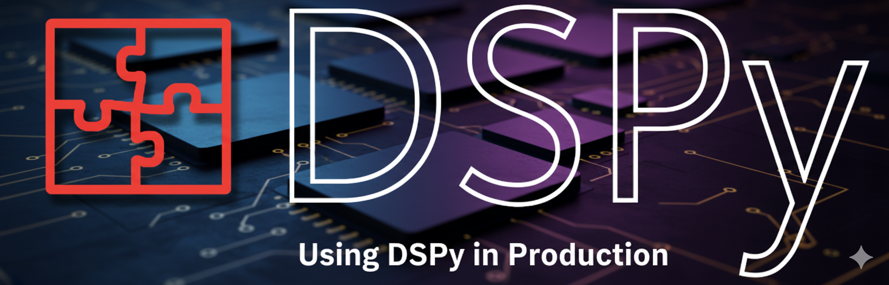
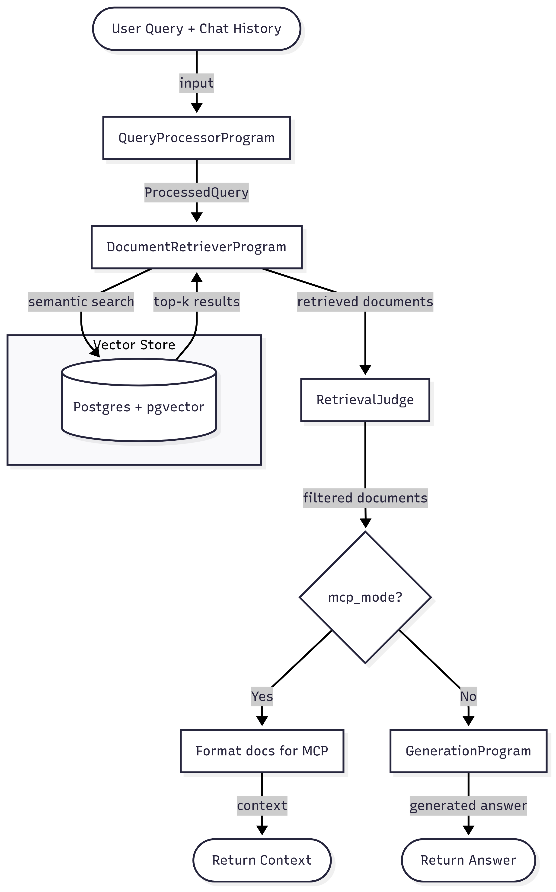
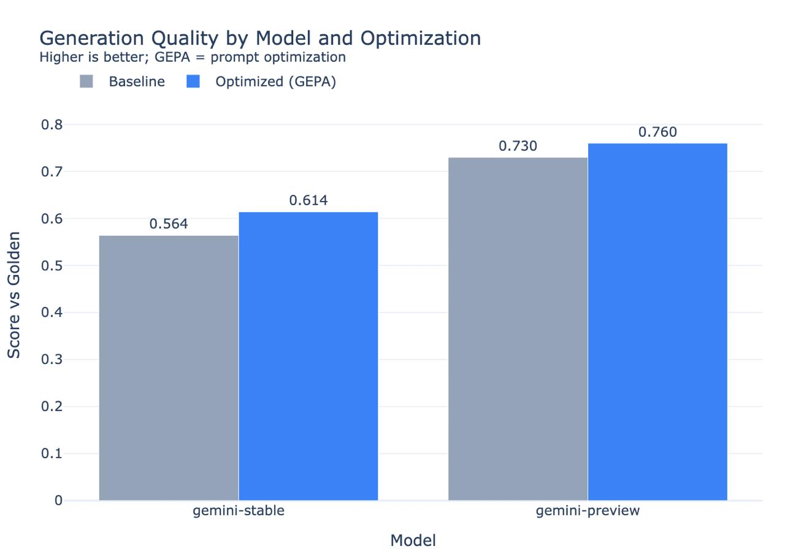
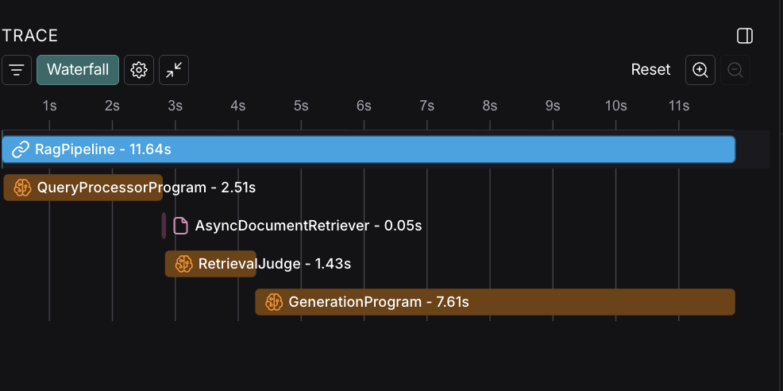

The following content is not an introduction to DSPy, nor is it a tutorial to learn how to use DSPy. I believe this topic has already been well covered (see articles by [Maxime Rivest](https://x.com/MaximeRivest/articles), [DSPy-0-to-1](https://github.com/haasonsaas/dspy-0to1-guide) and the [DSPy Documentation](https://dspy.ai/)). However, I believe that there's a lack of content on how to bring an AI-based app using DSPy to production, notably on using Async DSPy and I aim to close part of this gap with this article, inspired by a project that I've been working on.

*After writing this article, I found out that the DSPy documentation now has a [section on tooling, development, and deployment](https://dspy.ai/tutorials/core_development/) that addresses the same gap I aimed to cover here. Be sure to take a look!*

## Table of Contents

- [Composing DSPy Programs - An Async Approach](#composing-dspy-programs---an-async-approach)
- [Optimizing Programs](#optimizing-programs)
  - [Isolating The Program to Optimize](#isolating-the-program-to-optimize)
  - [Optimizers For Async Programs](#optimizers-for-async-programs)
  - [Defining The Right Metric Function](#defining-the-right-metric-function)
- [Third-Party Monitoring Services](#third-party-monitoring-services)
- [Serving the app with an API](#serving-the-app-with-an-api)
- [Conclusion](#conclusion)


I've made an opinionated choice on what tech stack to use based on what I had previous experience with. Notably, I've chosen to use:

- [LangSmith](https://www.langchain.com/langsmith) to monitor the app and export AI traces
- [FastAPI](https://fastapi.tiangolo.com/) to build APIs that will expose the DSPy pipelines to the outside world
- [Marimo](https://marimo.io/) as my notebook to experiment and develop optimizers.
- And, of course, [DSPy](https://dspy.ai/) as my AI framework!

Let's start with the core part of our application: a DSPy program. If I wanted to make a full tutorial, I'd invent a new toy program that you'd be able to build yourself to follow along; but instead, we'll just dissect what I've been doing while working on [Cairo Coder](https://github.com/KasarLabs/cairo-coder), a tool that enables [Cairo](https://www.cairo-lang.org/) developers to benefit from AI assistance in their code editors using an MCP server that injects relevant context into their coding assistant's context window. If you want to follow along with the source code, you'll find it in the [python directory](https://github.com/KasarLabs/cairo-coder/tree/main/python).

*I won't go deep into the details, but Cairo is a domain-specific language that's optimized for the creation of programs that are *provable*, meaning that you can generate a zero-knowledge proof of its execution.*

*Its syntax is close to Rust's, but with some discrepancies. The entire idea here is to use DSPy to fetch data from Cairo's documentation and common libraries so that LLMs can tune their outputs to be more Cairo and less Rust-like.*

## Composing DSPy Programs - An Async Approach

When I first started with DSPy, the first problem I hit was that I had only been exposed to it from a synchronous programming perspective in the tutorials and docs. As our goal is to build a production service that will handle concurrent requests, blocking the event loop for the time of the request to be fulfilled is not an option; especially when running the AI pipeline end-to-end could take up to 30-50 seconds depending on the complexity and the amount of output tokens.

The [DSPy Docs](https://dspy.ai/tutorials/async/#creating-custom-async-dspy-modules) indicate that you can create async modules by implementing the `aforward()` method instead of `forward()`, which should contain your module's async logic.

Our main DSPy module is called `RagPipeline` and is defined as such:

```python
class RagPipeline(dspy.Module):
    def __init__(self, config):
        super().__init__()

        # Initialize DSPy modules for each stage
        self.query_processor = config.query_processor
        self.document_retriever = config.document_retriever
        self.generation_program = config.generation_program
        self.mcp_generation_program = config.mcp_generation_program
        self.retrieval_judge = RetrievalJudge()

    @traceable(name="RagPipeline", run_type="chain")
    async def aforward(
        self,
        query: str,
        chat_history: list[Message] | None = None,
        mcp_mode: bool = False,
        sources: list[DocumentSource] | None = None,
    ) -> dspy.Prediction:
        chat_history_str = self._format_chat_history(chat_history or [])
        processed_query = await self.query_processor.aforward(
            query=query, chat_history=chat_history_str
        )
        documents = await self.document_retriever.aforward(
            processed_query=processed_query, sources=processed_query.resources
        )
        with dspy.context(
            lm=dspy.LM("gemini/gemini-flash-lite-latest", max_tokens=10000, temperature=0.5),
            adapter=XMLAdapter(),
        ):
            documents = await self.retrieval_judge.aforward(query=query, documents=documents)

        context = self._prepare_context(documents)
        if mcp_mode:
            return context

        return await self.generation_program.aforward(
            query=query, context=context, chat_history=chat_history_str
        )

    # ... other methods
```

It's called a *pipeline* because it's composed of three DSPy programs that are in charge of:

- Processing the user's query, extracting terms for semantic search in a database, and _routing_ the search to the right resources - the `QueryProcessor` program.
- Eliminating all the retrieved documents that are _not_ useful to answer the user's query - the `RetrievalJudge` program
- Either providing the retrieved context directly (MCP Mode) _or_ generating a direct answer to the user's query - the `GenerationProgram`.

You will notice that I did not include a `forward` method here. For some time, I was maintaining both a *sync* and an *async* version of my modules, because I was unable to make the optimizers work with the async version. However, this caused a few issues:

- As I was actively developing new features, I constantly had issues where I had to duplicate code in the sync `forward` and the async `aforward`.
- My tests were duplicated.
- I ended up maintaining code that was never going to be used in production *just* so that I could run the optimizers.

Clearly, this was not a viable approach for a long term project. However, I believe that I've found a good aproach that lets me keep the same code in my production app and my notebooks, which considerably simplifies maintaining my DSPy codebase.

Back to our code – the `RagPipeline` class is a module that orchestrates multiple DSPy programs.
While I'm using `gemini-flash` in the main context, I'm also using `gemini-flash-lite` for one of the sub-programs. DSPy lets you easily override the current context for a specific program by using the `with dspy.context()` context manager.

 Here's a look into another sub-program, the `GenerationProgram`, which is called in the final step of the pipeline:

```python
class CairoCodeGeneration(Signature):
    """
    Analyze a Cairo programming query and use the context to generate a high-quality Cairo code solution and explanations.
    Reason about how to properly solve the query, based on the input code (if any) and the context.
    """
    chat_history: Optional[str] = InputField(
        desc="Previous conversation context for continuity and better understanding", default=""
    )
    query: str = InputField(
        desc="User's specific Cairo programming question or request for code generation"
    )

    context: str = InputField(
        desc="Retrieved Cairo documentation, examples, and relevant information to inform the response. Use the context to inform the response - maximize using context's content."
    )

    answer: str = OutputField(
        desc="The Cairo code that solves the user's query. It should be complete, correct, and follow Cairo syntax and best practices. It should be wrapped inside a ```cairo block."
    )


```

It's a rather simple program! It takes as input a user's query and some context to answer the query and simply answers it with code. What's interesting here is that this can be called asynchronously by invoking it with `aforward` rather than a synchronous call. You'll notice that the program definition does not include any domain specific instructions; we'll use the prompt optimizers for that.

The following diagram reflects the current structure of the pipeline.



With this structure in mind, you should have a broad overview of how DSPy programs can be composed. The only thing I want to emphasize is that your programs should be designed **async-first** rather than synchronous. So far, there's nothing really complex — until we discover that optimizers need to run synchronous code!

## Optimizing Programs

When I first started with DSPy, I started an optimization run inside a Python script; that optimization run took 20 minutes, cost about $2, and after it ran, my script crashed before saving the output to a file and I lost all of the results.

Having done a lot of Rust and Typescript recently, I forgot that one of Python's strengths is the ability to use notebooks, in which you can run operations cell-by-cell, cache the results of intermediate cells, and iterate over your scripts easily.

I recently heard about [Marimo](https://marimo.io/), which is designed to fix many of the issues that Jupyter notebooks have; so I decided to use it as my main notebook to experiment with my optimizers with more freedom than I could in simple scripts.

If you've read the resources recommended in the introduction about DSPy, you should already be familiar with the optimization process:

- You define a dataset with inputs and their associated expected outputs
- You define the program you want to optimize
- You run an optimizer on that program that will run your program with the inputs, generate a prediction, compare that prediction to the expected output using a metric function, and iterate on prompts until the metrics improve.

It's simple when you see it written like that! But in reality, it's quite complex:

- Where do you get quality data to run your optimizers?
- How do you define your metric function?
- How do you integrate domain-specific concerns into the feedback so that prompts iterate in the right direction?

This part here is the _actual_ hard part about writing AI programs. I *roughly* know what my prompts should look like. I have a *vague idea* of the output I expect when I enter some queries. The reality is that **if you don't know what users will ask your AI, how can you know if you're giving them the right result?**

I can't tell you how to get this data for your use case, but I can tell you how I did for mine:

1. I asked ChatGPT Pro to generate a dataset of various queries that users could make to my app. I gave an extensive description of possible use cases so that it could generate a dataset of ~30 interesting queries that I could use as a base for my optimization runs
2. I hand-validated this dataset, and verified all the `(queries, expected)` tuples to create a quality dataset with properly labeled data (the boring part)
3. Once I had this dataset, I was able to start running the optimizations.
4. Later on, once my app was live, I collected real traces to get real-world data, and added them to my dataset to align my prompt performances with my user's needs.

### Isolating The Program to Optimize

For various reasons (complexity, time, effectiveness of the optimizations), I wanted to separate optimization of the retrieval part of my pipeline from optimizations of the generation part of my pipeline. When you run an optimization on a DSPy module, the optimizer will optimize _all_ of its internal *predictors* (= sub-programs of your module) at the same time. Consider the two following examples: in the first one, you're optimizing for both the `generation_program` and the `context_retriever`; in the second one, only  the `generation_program`.

```python
class ProgramToOptimize(dspy.Module):
    def __init__(self):
        self.generation_program = generation_program
        self.context_retriever = context_retriever

    async def aforward(
        self,
        query: str,
        chat_history: list | None = None,
        mcp_mode: bool = False,
        sources: list[DocumentSource] | None = None,
    ) -> dspy.Prediction:
        context = await self.context_retriever.aforward(query=query, mcp_mode=True)
        return await self.generation_program.aforward(
            query=query, context=context, chat_history=None
        )
```

```python
# context_retriever defined outside!
class ProgramToOptimize(dspy.Module):
    def __init__(self):
        self.generation_program = generation_program

    async def aforward(
        self,
        query: str,
        chat_history: list | None = None,
        mcp_mode: bool = False,
        sources: list[DocumentSource] | None = None,
    ) -> dspy.Prediction:
        context = await context_retriever.aforward(query=query, mcp_mode=True)
        return await self.generation_program.aforward(
            query=query, context=context, chat_history=None
        )
```

If your goal is to only optimize for `generation_program` like me, then one easy workaround is to not optimize the entire `RagPipeline` that we defined previously, but create a specific module whose only member is the `generation_program`. The part related to context retrieval is defined _outside_ of that module.

Now that we've properly isolated the program to optimize, let's run it.

### Optimizers For Async Programs

```python
opt_program = ProgramToOptimize()
examples = [dspy.Example({
        "query": "Create an ERC20 token contract named 'MY_ERC20' with 18 decimals and an initial supply minted to the deployer. Once deployed, nothing else can be minted, and there is no owner.",
        "reference": read_lib_file("erc721_nft")
    }).with_inputs("query")]
evaluate = dspy.Evaluate(
    devset=examples,
    metric=compute_overall_score_with_feedback,
    num_threads=12,
    display_table=True,
    display_progress=True,
)
evaluate(opt_program)
```

```bash
2025-09-28T16:35:55.204782Z [error    ] Error for Example({'query': "Create an ERC20 token contract named 'MY_ERC20' with 18 decimals and an initial supply minted to the deployer. Once deployed, nothing else can be minted, and there is no owner.", 'reference': "<...>"}) (input_keys={'query'}): 'ProgramToOptimize' object has no attribute 'forward'. Set `provide_traceback=True` for traceback.
```

If you've followed an async-first approach, you'll eventually hit one of these errors. There's one easy workaround, though: you can wrap your DSPy module with `syncify` to make it synchronous.

```python
opt_program = dspy.syncify(ProgramToOptimize())
examples = [dspy.Example({
        "query": "Create an ERC20 token contract named 'MY_ERC20' with 18 decimals and an initial supply minted to the deployer. Once deployed, nothing else can be minted, and there is no owner.",
        "reference": read_lib_file("erc721_nft")
    }).with_inputs("query")]
evaluate = dspy.Evaluate(
    devset=examples,
    metric=compute_overall_score_with_feedback,
    num_threads=12,
    display_table=True,
    display_progress=True,
)
evaluate(opt_program)
```

This should work in most cases! Not mine, though: my async modules used PostgreSQL connection pools via `asyncpg`, but the `dspy.syncify()` wrapper uses `asyncio.run()` under the hood, creating a fresh event loop for each call to the wrapped async method.

This caused my database code to create a new connection pool for every single database query, rapidly exhausting PostgreSQL's connection limits and causing connection overflow errors.

To solve this, I implemented an environment variable (`OPTIMIZER_RUN`) that switches my database access pattern from connection pooling to per-call connections when running optimizations. This way, each database operation uses a single connection that's properly opened and closed, avoiding connection leaks while maintaining efficient pooling for production use!

This should address _most_ of the async/sync issues that you can encounter when you run optimizers, and this can easily be adapted to your use case. These quick workarounds let you run the optimizers on the same code that you'll use in production, which spares you from maintaining two separate codebases!

### Defining The Right Metric Function

Running the optimizers is quite straightforward once you've properly defined the program to optimize and the dataset. In this example, we use the GEPA optimizer.

GEPA has an interesting feature in that it uses textual feedback on top of scalar scores to steer the prompt in the right direction. However, knowing _what_ feedback to give might not be obvious!

Let me remind you of our use case:

1. The user inputs a query to generate some code
2. The system must return code adapted to answer that query

A simple metric function is to assign `0` if the code does not compile, `1` if the code compiles. But how do we know the code is answering the query? This metric can be hacked by always returning empty code that compiles.

Thus, I've decided to define my metric function as a combination of the compilation result and an analysis of the answer using an LLM-as-a-Judge. This actually fits GEPA very well, because:

- Our judge is tasked to give a score to the output
- We can ask the judge to give textual feedback on how to improve the score
- We can provide the judge with instructions on how to give feedback
- We can give the judge all kinds of inputs that will help it with the feedback

As such, here's how I defined my judge using another DSPy module:

```python
class GeneratedCodeRater(dspy.Signature):
    """
    Analyze the user's query and its generated code. Use the compilation result and the logic of the generated code to assign it a score on how well it answers the user's query, and provide feedback on what to improve based on Cairo and its ecosystem knowledge and the golden code reference.
    """

    query: str = dspy.InputField(desc="The user's query")
    generated_code: str = dspy.InputField(desc="The Cairo code that was generated from the user's query")
    compilation_result: str = dspy.InputField(desc="The result of compiling the generated code. If it succeeded, this is a string 'The program compiles successfully.'. Otherwise, it's the error message. ")
    golden_reference: str = dspy.InputField(desc="A golden code reference of what the ideal code looks like.")
    score: float = dspy.OutputField(
        desc="A confidence score in the range [0, 1.0] on the possibility to give a precise and fully accurate answer based on the provided context. 0 means that the code is totally wrong, as it has logical issues and won't compile; 0.5 means that the code is mostly correct, though there might be a few minor compilation issues, and it's close to the golden reference; 1.0 means that the code is correct, similar in behavior to the reference, and it compiles."
    )
    feedback: Optional[str] = dspy.OutputField(
        desc="Textual feedback on how to improve the generated code. First, have we properly leveraged libraries (mostly OpenZeppelin), are our corelib imports correct, and have we imported the right items? If not, what should we change, based on the reference? Second, how can we fix our compilation issues, based on the golden reference? Third, is the logic correct? If we made logical errors, how do we fix them? Are we properly leveraging the Cairo features outlined in the golden example? Finally, note all differences between the golden reference and the prediction and provide feedback on how to make the code closer to the golden reference.\n A few Cairo-specific things for feedback:\n 1. Events should #[derive(Drop, starknet::Event)]. No need to `use starknet::Event`, which may cause further conflicts. 2. If the compilation errors are cryptic, base your feedback primarily on the differences you observe between the golden reference and the generated code."
    )

## Metrics for self-improvement: Rating whether the context provided can be used to answer the question properly or not.
gencode_rater = dspy.Predict(GeneratedCodeRater)

def compute_metrics(gold, pred, trace=None) -> dict:
    gen_code = extract_cairo_code(pred.answer)
    if gen_code == "":
        return {"score": 0.0, "feedback": f"No code was successfully generated for this query. The reference was: {gold.reference}"}
    compil_res = check_compilation(gen_code)
    if compil_res["success"] is False:
        compil_string = compil_res["error"]
    else:
        compil_string = "The program compiles successfully."
    with dspy.context(
        lm=dspy.LM("openrouter/x-ai/grok-4-fast:free", max_tokens=30000), adapter=XMLAdapter()
    ):
        response_rating = gencode_rater(
            query=gold.query,
            generated_code=gen_code,
            compilation_result=compil_string,
            golden_reference=gold.reference,
        )
    return {"score": response_rating.score, "feedback": response_rating.feedback or ""}
```

You will notice that the judge's instructions contain both general-purpose instructions and domain-specific instructions. I strongly advise you to start a small optimization run, **observe** how the feedback is given and how the prompts evolve, and tune the judge's instructions to help it go in the right direction.

Once your metric is defined, you can start your run!

```python
from dspy import GEPA
gepa_run_dir = os.path.join(os.getcwd(), "./gepa-run-logs")

optimizer = GEPA(
    metric=compute_overall_score_with_feedback,
    auto="light",
    num_threads=12,
    track_stats=True,
    log_dir="./gepa-run-logs",
    reflection_lm=dspy.LM(
        model="openrouter/x-ai/grok-4-fast:free", temperature=1.0, max_tokens=32000
    ),
)
optimized_program = optimizer.compile(
    generation_program,
    trainset=train_set,
    valset=val_set,
)
```

Once the optimization is finished, you can export the optimized program to a JSON file.

```python
    os.makedirs("./dspy_program", exist_ok=True)
    optimized_program.save("./dspy_program/program.json", save_program=False)
```

This will save the instructions specific to the `ProgramToOptimize`, which is not the same as our entire pipeline which is composed of multiple sub-programs. What I do in this case is that I call `save` on the `RagPipeline` instance, and then just copy-paste the signatures generated for `ProgramToOptimize` to the `RagPipeline` saved file.

In my production app, I'll just load the optimized program this way:

```python
    rag_program = RagPipeline(config)
    # Load optimizer
    compiled_program_path = "optimizers/results/optimized_rag.json"
    rag_program.load(compiled_program_path)
```

If you open the `json` file corresponding to the optimized program, you'll see the following structure:

```json
  "program_name": {
    "traces": [],
    "train": [],
    "demos": [],
    "signature": {
        "instructions": "...",
        "fields": [{...}, {...}, ...]
    }
}
```

When you run GEPA, it will update the `instructions` field of the `signature` object with the optimized instructions. The fields and their descriptions stay the same.

The results of the optimization are quite good on our code generation program! We're up 5 points when optimizing Gemini Flash (stable), and 3 points when optimizing Gemini Flash (preview).



## Third-Party Monitoring Services

If you're running an AI application, you need to have insights into what's happening inside your system so that you can improve it properly. I've chosen to integrate with [LangSmith](https://docs.langchain.com/langsmith/home), but you can explore other observability frameworks like [Langfuse](https://langfuse.com/) or [MLflow](https://mlflow.org/). The [DSPy docs](https://dspy.ai/tutorials/observability/#tracing) indicate how to integrate MLflow with DSPy, which you can self-host; but I've found that LangSmith was easier to setup and use for my use case.

In fact, integrating LangSmith is dead simple: you only need to add the langsmith dependency, some environment variables, and apply the `@traceable` decorator to the functions you want to trace. What I like the most about it is that you can control the granularity of each trace easily. Here's an example of a trace, showing the different steps of the pipeline. You can inspect in details the inputs and outputs of each step to evaluate how your system is performing.



Once you start collecting traces, you'll get better insights into the queries that your users are sending to your app. Make sure that you take those queries and make them part of your training dataset; this gives you a strong dataset of real-world data for your optimizers.


## Serving the app with an API

I've chosen FastAPI to create an API that's compliant with OpenAI's completions API. I'm not sure it's very relevant to go in depth about the integration of the DSPy pipeline here, as it's as simple as

1. Receiving a request
2. Calling `aforward` on an instance of the DSPy pipeline
3. When the async call ends, return the response.

Having implemented my pipeline in an async way, I'm not blocking the event loop of a thread for the duration of the request, which helps me process more requests in parallel while waiting for the AI providers to send their responses.

## Conclusion

Writing this article made me realize how easy using DSPy is. The entire architecture of this app used to be written in Typescript with Langchain, and the experience became so miserable that I decided to re-write everything in Python *just* so that I could use DSPy. I was spending considerable resources into writing my own "prompt adapters" and extracting data from the prompts, I was managing dozens of detailed prompt variations, and I was getting lost in the chaining of all the programs together.

If I had to remember three things from this article, those would be:
- Adopt an async-first approach to DSPy
- Don't be lazy and do the _actual_ work, which is building a strong dataset for training and evaluations
- Implement proper tracing and monitoring so that you can observe and improve your application using real world feedback

With this in mind: have fun using DSPy!
